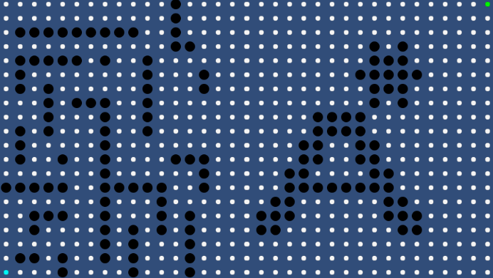

# Pathfinding
Pathfinding (Dijkstra, A*) with Unity 

It has tests and is a beautiful Unity project.

BUT: It is not using a priority queue yet, which makes it slow as it is based on a sorted list instead.
May be updated later!

Also, it is showing how the algorithms work by skipping a frame after each step of the algorithms, so the rendering can be done. It is hence not optimized for performance. If someone were to use it in a game for pathfinding, the algos have to be executed in one pass instead of one step a frame.

# Dijkstra

# A*

